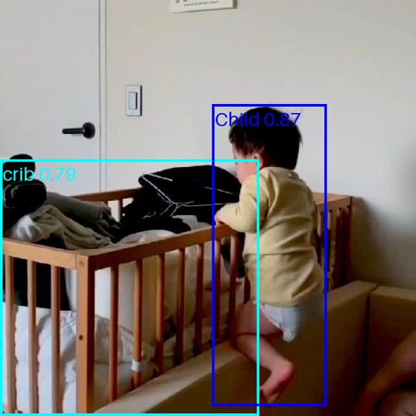

# Crib Sentry

## Author
Seth Alvarez

## Project Tier
Tier 2: three detectors and the logic that changes their boxes into one alert.

## Problem Statement
A traditional baby monitor only helps if someone is watching it. Parents cannot watch all the time, so much of what the camera records goes unnoticed. The goal is to cut down on what gets missed.

## Solution Overview
The system takes one image from a crib camera and runs three detectors. One finds the crib, one finds the child, and one finds hazards (toys and blankets). Then it compares the positions of the boxes and gives one of four alerts: all clear, left the crib, not visible, or hazard present.

## How the System Decides the Alert
1. If the system finds no crib box, the alert is "not visible."
2. A box is inside the crib when more than half of its area is inside the crib box.
3. A child box that is not inside the crib box gives "left the crib."
4. A toy or blanket box inside the crib box gives "hazard present."
5. No child box gives "not visible."
6. A child box inside the crib box with no hazard inside gives "all clear."

When more than one alert applies, the order is: left the crib, hazard present, not visible, all clear.

## Technical Approach
- CV technique: Object detection
- Model architecture: CNN
- Model: YOLO11n, three models
- How I use it: Transfer learning from weights pretrained on COCO, 50 epochs for each detector
- Framework: PyTorch through Ultralytics
- Augmentation: Darker and lighter images, blur and rotation during training
- Why: Each alert depends on the position of one box compared to another box, so I need bounding boxes.

## Dataset

| Source | Used for | Size | License |
|---|---|---|---|
| [Baby in Crib](https://universe.roboflow.com/test-1caua/baby-in-crib) | Crib and Child training, and my 24 test images | 242 images, split 169/49/24 | CC BY 4.0 |
| [Crib_detection](https://universe.roboflow.com/internship-cqxlp/crib_detection-xgv9n) | Crib training | 1,494 images | CC BY 4.0 |
| [BASE crib only BABY only](https://universe.roboflow.com/first-workspace-9obfx/base-crib-only-baby-only-7ytse) | Child training | 309 original images | CC BY 4.0 |
| [Baby object detection final](https://universe.roboflow.com/vtar/baby-object-detection-final) | Child training, and my 10 "left the crib" test images | 3,136 original frames for training | CC BY 4.0 |
| [CribHD](https://github.com/ostadabbas/CribNet) T and B | Hazard training | 1,369 training images | Non-commercial |
| CribHD-C | Held-out test | 120 images, no labels | Non-commercial |

More details are in [data/README.md](data/README.md).

## Results

| Metric | Target | Result |
|---|---|---|
| Alert accuracy on the 24 test images | 85% or more | 70.8% (17 of 24) |
| Time for each image on a T4 GPU | Less than 1 second | 0.034 seconds |
| "Left the crib" on 10 images from a different dataset | No target | 7 of 10 |
| Alert accuracy on the 120 CribHD-C images | No target | 41.7% (50 of 120) |

I did not meet the 85% target. The full tables and the errors are in [results/README.md](results/README.md).

A correct alert: the child climbs out and the system gives "left the crib."

A failure: the child climbs out, but the system gives "all clear." In this side view, the child box is still on the crib box, so my "inside" rule reads the child as inside.

## What Changed From the Blueprint
- **Two detectors became three.** My first detector found the child and the crib together. It got 75.0% on the test images and 0 of 10 on "left the crib." I split it into a Crib detector and a Child detector so each one can train on more data.
- **I added three training datasets.** Baby in Crib has studio photos, and the first detector failed on real rooms. Crib_detection adds more cribs. BASE crib only BABY only and Baby object detection final add real camera frames of children.
- **I removed wrong labels.** Baby in Crib had 18 crib boxes on photos that show a baby with no crib. I removed them.
- **I did not use one dataset.** objetos_bebes has boxes on the head or a part of the body, and my system needs a box on the full child.
- **I used Plan B for risk 2.** No dataset had a child out of a crib, so I found 10 test images of that in Baby object detection final. I removed their videos from the training data.

## Milestone Plan

| Phase | Goal | Milestone | Week |
|---|---|---|---|
| Blueprint | Plan approved | Midterm submitted | 6 |
| First Working Demo | Pretrained model runs start to finish on a few sample images | Something works, even if rough | 7 |
| Make It Yours | Add data, training, and alert logic | System works on my problem | 7-8 |
| Improve and Measure | Test, fix, and measure against the metrics | Metrics recorded | 8 |
| Package and Present | Demo video, README, final slides | Final submitted | 9 |

## Resources
- Compute: Google Colab free tier with a T4 GPU
- Cost: $0. Each model, dataset and tool that I use is free or open source.

## Risks and What Happened

| Risk from the Blueprint | What happened |
|---|---|
| The system does not find a child that lies down or is partly below a blanket | On CribHD-C, the Child detector finds the doll in 104 of 120 images, and a blanket is on most dolls. The larger problem there is the crib: the Crib detector finds it in only 76 of 120 images. |
| No dataset has a child out of a crib | I used Plan B and found 10 test images. The first system got 0 of 10 and the new system gets 7 of 10. |

## Notebooks

| Notebook | What it does |
|---|---|
| 01 | First working demo |
| 02, 03 | Train the first Child and Crib detector and the hazard detector |
| 04 | Alert logic and the first measurement |
| 05, 06 | Train the new Crib detector and the new Child detector |
| 07 | Measure the old system and the new system on the same test images |
| 08 | Measure the two systems on CribHD-C |
| 09 | Demo |

## Demo Video
Link goes here.

## AI Usage Log
See [docs/AI_usage_log.md](docs/AI_usage_log.md)

## Current Status
- [x] Repository created
- [x] Proposal submitted
- [x] First working demo
- [x] System works on my data
- [x] Metrics measured
- [ ] Final submitted
